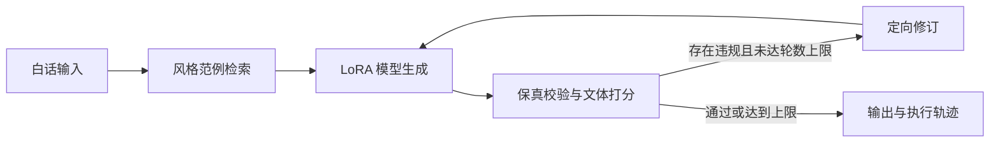

# sutong-style

将现代白话中文改写为苏童文风的文本风格迁移系统。在 Qwen2.5-3B-Instruct 上做 LoRA 微调，并在模型之外实现了文体评估、风格范例检索和生成自检重写环三个模块。

## 项目概览

项目的出发点是一个可用但存在缺陷的微调模型。它在追求文风时会改动原文的事实信息，例如把「太医」写成「宫监」、把「万人大军」写成「十万铁骑」。项目在不改动模型权重的前提下，围绕它搭建了下面这条流水线，并对每一层的效果做了定量评估。



各模块的职责如下。

| 模块 | 目录 | 说明 |
|---|---|---|
| 文体特征 | `stylometry/` | 20 维文体特征（句长分布、标点、虚词、书面语词命中率等）与风格距离。书面语词表从平行语料中自动学习，不依赖外部词表 |
| 评估 | `eval/` | 实体、数值、称谓的规则化保真校验；逐条文体差距；可选的 LLM 成对评判 |
| 检索 | `retrieval/` | BM25、稠密向量、文体向量三路召回，以加权 RRF 融合；范例以多轮对话形式拼入 prompt |
| 自检重写环 | `agent/` | 基于 LangGraph 的「生成、校验、打分、路由」循环，最多三轮，环内只使用确定性指标 |
| 演示页面 | `web/` | 单页前端：输入、流式输出，以及逐步展示检索、生成、校验、修订的执行过程面板 |
| 服务接口 | `api/` | FastAPI 与 SSE 流式接口，同时推送生成文本与节点执行轨迹；模型由独立的 GPU 进程提供，接口进程不加载模型 |

## 主要结果

评估集为 59 条留出样本，贪心解码，随机种子 42。下表为各阶段在主要指标上的结果，完整指标与逐项解读见 [docs/RESULTS.md](docs/RESULTS.md)。

| 流水线 | 文体差距 ↓ | 实体保留率 ↑ | 数值保留率 ↑ | 幻觉率 ↓ | 与输入的相似度 |
|---|---|---|---|---|---|
| 白话输入（不做改写） | 0.623 | — | — | — | — |
| 基座模型（未微调） | 0.748 | 0.958 | 0.923 | 0.0042 | 0.875 |
| LoRA 微调 | 0.514 | 1.000 | 0.861 | 0.0141 | 0.709 |
| 微调 + 风格范例检索 | 0.485 | 1.000 | 0.892 | 0.0042 | 0.742 |
| 微调 + 检索 + 自检重写环（第一轮实验） | 0.485 | 1.000 | 0.920 | 0.0042 | 0.750 |
| 微调 + 检索 + 自检重写环（第二轮实验） | 0.486 | 1.000 | 0.898 | 0.0000 | 0.742 |

表中「文体差距」对应 `profile_gap_per_case`，即输出与对应原文在 20 维文体特征上的平均绝对差，原文自身为 0；其余四列依次对应 `entity_recall`、`numeral_recall`、`hallucination_rate` 和 `copy_ratio`。

主要结论：

- 微调是效果的主要来源。未微调的基座模型使文体差距从 0.623 升至 0.748，微调后降至 0.514，同时实体保留率达到 1.000。代价是数值保留率下降、幻觉率上升。
- 风格范例检索使文体差距、数值保留率和幻觉率均向好的方向移动，但在 59 条样本上，配对差的 95% 自助置信区间均包含 0，按预先登记的判定规则记为未检出差异。
- 自检重写环未能可靠地改善保真。第一轮实验中数值保留率的提升（+0.028，区间不含 0）经核查部分来自校验器的缺陷：模型会把修订指令原样复述到输出中，而指令引用了缺失的片段，校验器因此判定为已修复。第二轮实验加入回显防护并调整了反馈格式，主要指标均未检出差异。
- 各阶段的判定规则均在运行实验之前写入 [docs/SPEC.md](docs/SPEC.md)（§4.7–4.9），实验后未作修改；未达到预期的结果均如实记录。

## 项目结构

```
sutong-style/
├── stylometry/        文体特征抽取、书面语词表、风格距离
├── eval/              保真校验、评估入口、LLM 评判、评估报告
│   ├── configs/       评估配置
│   └── reports/       各阶段的评估报告与运行清单（不含正文）
├── retrieval/         BM25、稠密检索、文体检索、融合与 prompt 构造
├── agent/             自检重写环：状态、节点、图、修订 prompt
├── api/               FastAPI 服务、SSE 流式接口与真实流水线的装配
├── web/               演示页面（Vite、React、TypeScript、Tailwind）
├── infra/             外部模型的具体实现（嵌入、OpenAI 兼容接口、模型服务客户端）
├── scripts/           语料处理、训练、生成、模型服务、各阶段实验与评估脚本
├── corpus/            语料目录；原文不入库，仅保留不可还原原文的衍生数据
├── tests/             单元测试与集成测试，全部使用 Fake 实现，不依赖 GPU
└── docs/              规格、计划、变更记录与结果说明
```

## 快速开始

环境要求：Python 3.11，使用 [uv](https://docs.astral.sh/uv/) 管理依赖。以下步骤不需要 GPU，也不需要语料。

```bash
git clone https://github.com/SHAOHANYANG/sutong-style.git
cd sutong-style
uv sync
```

运行测试与静态检查：

```bash
uv run pytest -m "not gpu"
uv run ruff check .
uv run mypy .
```

启动服务接口：

```bash
uv run uvicorn api.main:app --host 0.0.0.0 --port 8000
```

```bash
curl -N -X POST http://localhost:8000/v1/transform \
  -H "Content-Type: application/json" \
  -d '{"text":"他在河边等了三天。","style":"sutong","stream":true,"max_iter":3,"seed":42}'
```

接口以 SSE 依次返回 `trace`（节点执行轨迹）、`token`（带轮次的生成文本）和 `done`（最终结果）事件。未配置模型服务时，依赖为占位实现，`/healthz` 返回 503；接入真实模型的方法见下一节。

## 运行完整服务

完整服务由两个进程组成。模型服务在 GPU 上加载微调后的模型和查询编码器，对外提供 OpenAI 兼容接口；接口进程负责检索、校验、打分和修订循环，通过 HTTP 调用模型服务，自身不依赖 PyTorch。运行需要本地已有语料、适配器权重和稠密索引（见「复现实验」）。

```bash
# 进程一：模型服务（GPU 环境）
python -m scripts.serve_model --adapter adapters/sutong-v2/adapter --host 0.0.0.0 --port 8001

# 进程二：接口服务
SUTONG_MODEL_BASE_URL=http://localhost:8001/v1 uv run uvicorn api.main:app --port 8000
```

```bash
# 进程三（可选）：演示页面，默认访问 http://127.0.0.1:8000 的接口
cd web && npm install && npm run dev
```

演示页面在 http://localhost:5173 打开。页面上方是输入与流式输出，下方的面板随请求进展逐步显示每个节点做了什么：检索到哪些范例、每一轮写了多少字、校验发现了哪些事实改动、为什么重写、最终采用哪一轮。接口地址可用环境变量 `VITE_API_BASE` 指定；接口服务允许访问的页面来源由 `SUTONG_CORS_ORIGINS` 配置。

此时 `/healthz` 返回 200，`/v1/transform` 对每个请求依次执行：三路检索取 2 条风格范例、模型生成、保真校验与文体打分，存在违规时把修订要求写入 system 消息后重新生成，最多三轮。

在 RTX 5060 Laptop（8GB）上顺序发送 10 个请求（输入 35–49 字，自行撰写的白话）的实测结果：全部成功，无兜底；8 个请求一轮通过，平均 2.5 秒；2 个请求触发修订，分别为 7.6 秒和 7.9 秒；总体中位数 2.2 秒。两个模型合计占用显存约 5.1 GB。这是单机顺序请求的冒烟测量，不是并发压测。

## 复现实验

训练和生成需要一张支持 CUDA 的显卡（实测为 8GB 显存），并需自备语料。完整的环境搭建步骤、版本组合与已知问题见 [docs/REPRODUCE.md](docs/REPRODUCE.md)，下面是各阶段的入口命令。

```bash
# 训练（约 13 分钟）
python -m scripts.train --run-id sutong-v2

# 生成：不带 --adapter 时使用未微调的基座模型
python -m scripts.generate --run-id base-eval59
python -m scripts.generate --run-id lora-eval59 --adapter adapters/sutong-v2/adapter

# 评估：--skip-judge 不发起任何网络请求
uv run python -m eval.run_eval --config eval/configs/eval59.yaml \
  --generations corpus/generations/lora-eval59.jsonl --run-id lora-eval59 --skip-judge

# 检索实验：生成检索计划、扫描范例数量、汇总评估
python -m scripts.build_dense_index
python -m scripts.build_query_cache
uv run python -m scripts.build_retrieval_plan
python -m scripts.sweep_topk --adapter adapters/sutong-v2/adapter
uv run python -m scripts.eval_sweep

# 自检重写环实验（--experiment v2 为第二轮）
python -m scripts.run_agent_eval --adapter adapters/sutong-v2/adapter
uv run python -m scripts.eval_agent
```

训练、索引构建、检索扫描和自检重写环的脚本支持 `--dry-run`，可在不加载模型的情况下核对数据与配置。

## 评估方法

- 文体差距：对输出与对应原文分别抽取 20 维文体特征并按参照分布标准化，取逐维绝对差的均值。该指标需要原文作为参照。
- 保真指标：从输入与输出中抽取实体、数值和称谓并比对。数值经归一化后比较，实体抽取结合通用词性标注与从语料构建的专有名词表。
- 统计判定：阶段间的比较采用逐条配对差，以 10000 次自助重抽样估计均值差的 95% 置信区间；区间不含 0 时才判定为改善或恶化。
- 预先登记：每个阶段的比较对象、主配置和判定规则在实验运行前提交到规格文档，探索性配置单独列出，不替换主配置的结果。

指标的完整定义见 [docs/SPEC.md](docs/SPEC.md) 第 2、3 节。

## 数据与版权

苏童作品受版权保护，原文不包含在本仓库中，也不在本仓库许可的范围内。仓库中只保留以下内容：

- 语料预处理与重建流程的代码（`scripts/prepare_corpus.py` 等）
- 不可还原原文的衍生数据：词表、专有名词表、文体特征的均值与方差、评估指标与输出哈希
- 5 条自行编写的示例（`corpus/sample_public.jsonl`）

复现实验需自备文本并运行预处理脚本。LoRA 权重不随本仓库分发，可按上文的训练命令自行训练。

发布前可运行以下命令，检查当前文件及全部 Git 历史中是否包含原文片段：

```bash
uv run python -m scripts.check_corpus_leak --history
```

## 已知局限

- 评估集只有 59 条，统计检验的效力有限；自检重写环实际可能影响的样本只有 13 条。
- 训练与评估所用的白话输入由大模型从原文改写得到，保留了原文的内容与叙事顺序，与真人撰写的白话存在分布差异。针对真人输入的评估尚未完成。
- 保真指标基于规则抽取，是代理指标，无法发现语义层面的偏差；数值规则对「一 + 量词」和序数偏严。
- 自检重写环的保真指标与其校验规则同源，改善在一定程度上是构造使然；人工抽查尚未完成。
- LLM 成对评判的结果目前不可引用：交换候选位置后约一半样本的判定发生改变。
- 微调后的模型未能学到原文的句长变化，相关特征在微调前后基本不变。

完整列表见 [docs/LIMITATIONS.md](docs/LIMITATIONS.md)。

## 文档

| 文档 | 内容 |
|---|---|
| [docs/SPEC.md](docs/SPEC.md) | 技术规格：数据格式、指标定义、各阶段预先登记的判定规则 |
| [docs/RESULTS.md](docs/RESULTS.md) | 完整指标表与逐项解读 |
| [docs/REPRODUCE.md](docs/REPRODUCE.md) | 环境搭建与各阶段的完整复现命令 |
| [docs/LIMITATIONS.md](docs/LIMITATIONS.md) | 已知局限的完整列表 |
| [docs/CHANGELOG.md](docs/CHANGELOG.md) | 各阶段的实现记录、指标变化与问题 |
| [docs/PLAN.md](docs/PLAN.md) | 任务划分与验收标准 |

## License

代码以 [MIT License](LICENSE) 发布。许可覆盖本仓库中的代码、文档和已提交的衍生数据，不包括苏童作品的原文。基座模型 Qwen2.5-3B-Instruct 适用其自身的 Qwen Research License。
